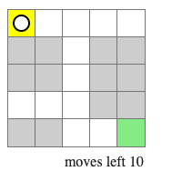

# Labyrinth technical challenge

> This challenge requires you to build a small application that works as a game using React.js.

 

## The rules of the final game are the following:
> * You (the black and white circle) start at a customizable initial position
>   
> * You can move using your keyboard's arrows (up/down/left/right)
> * Your objective is to move from the initial cell (yellow) to the target cell (green) before you run out of moves:
>   
> * When you win, you will get a "You won" message and won't be able to move any more
> * If you do run out of moves before you reach the target cell, then you lose:
>   
> * When you lose, you will get a "You lost" message and won't be able to move any more

 

## Technical requirements
* You can add any library you consider will help you build or test the game as long as they are "regular web application" libraries. That means you can use libraries that help you with styles, state management, testing, etc, but not libraries that are meant exclusively for building games.
* You have to pass the `unit tests` written in the `Labyrinth.test.tsx` file, but you can change those tests and the component's props if you consider that doing so might lead you to a better result.
* You have to test the application/components covering more functionality than the one covered by the provided tests.
* You have to build this application to the best of your abilities considering customization and the possibiility of extending it in the future.

 

## Nice to have
> Not doing these items **WON'T** be penalized and **you are not required to do any of them**, but if you do decide to do some of them, they might add to your *score* always considering code quality
* Styling (for example the circle/cells can be images or have movement/direction animations)
* Restart functionality
* Level progression (win and go the next level) 
* High scores
* Level builder
* War fog
* Anything you think might add value
---
## Solution Updates

### Game Features

* Rules described on the challenge for movements with start and target locations to finish the level.
* Batman is the main character to interact.
* War fog where you do not know where is the target which in this case is a diamond to be collected.
* Support for multiple levels taking account the **Level** type where you can add as many levels you want going to the `level.ts` and adding one more level on the `LEVELS` constant var in line 180 where you can also change the levels order for the player.
* Message from the game for the user for win or lose cases.
* Restart the game when you lose or you already completed all levels.
* CSS animations for character and game terrain for nice UX.
* Scoring info to know how many loses or wins the player has.
* Current level info on the scoring.
* Game terrain with walls for obstacles, grass for free spaces, castle for initial position, diamond for the target cell.
* When you complete the game you will see a start on the scoring.
* EXTRA SECRET GAME BONUS: After complete 1 game you will see a new button to a funny batman video called "BECAUSE I'M BATMAN!!"
* Level progression (win and go the next level) and level progress.

### LIVE DEMO ON HEROKU

GO TO DEMO: https://puzzle-challenge-batman-version.vercel.app

### Used asset authors

Background level:
<a href="https://www.freepik.com/free-vector/gold-mine-tunnel-inside-view-cave-with-railway_30895627.htm#query=2d%20game%20background%20cave&position=13&from_view=search">Image by upklyak</a> on Freepik

Batman character css:
Batman Pixel Art @jordi_com based on code of Joan Leon @nucliweb

Diamond : <a href="https://www.vecteezy.com/vector-art/5008466-vector-pixel-diamonds-pixel-art-style-8-bit">Vector pixel diamonds. Pixel art style. 8-bit Vectors by Vecteezy</a>

